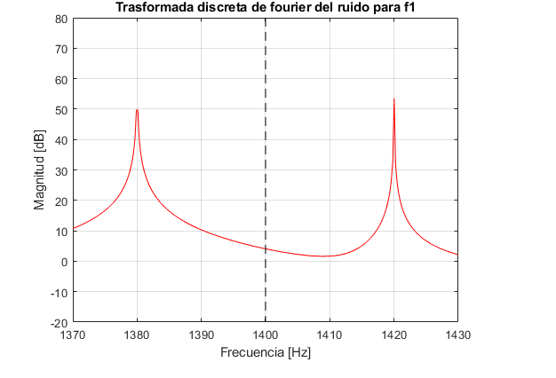

# Procesamiento de señales I (86.51) 
# Trabajo Practico I: Diseño de filtros diigitales

## 1. Introducción

Objetivo Se requiere procesar una señal de audio transmitida entre dos equipos a través de un determinado medio. En el equipo receptor, la señal se recibe contaminada por varias interferencias de banda angosta, como se observa en la Figura 1.




Para mitigar este problema, afectando lo menos posible a la señal original, se propone el diseño e implementación de un filtro FIR digital de Fase Lineal Generalizada. El diseño deberá contemplar múltiples eliminabandas selectivos en frecuencia.
### 1.2.
 Requerimientos La selectividad deberá ser definida de manera tal que el ancho de banda utilizado para suprimir cada componente de interferencia no exceda los 300 Hz. Se requiere que la máxima variación en las bandas de paso y suprimida no superen δp = 0, 08 y δs = 0, 016 respectivamente.
## 2. Desarrollo
*Problema 1* 
(a) 

Utilice la función audioread() de Matlab para cargar la señal de interferencias. Grafíque el espectro de dicha señal y verifique las frecuencias de las tres componentes principales

```matlab
clear; close all; clc
addpath("C:.\FiltrosDigitales\TP1_FiltrosDigitales\CANCIONES");

%Señales
[S1, Fs_1] = audioread("Pista_01.wav");
[S2, Fs_2] = audioread("Pista_02.wav");
[S3, Fs_3] = audioread("Pista_03.wav");
[S4, Fs_4] = audioread("Pista_04.wav");
[S5, Fs_5] = audioread("Pista_05.wav");
%interferencias
[V1, Fs_v1] = audioread("interferencias.wav");
%[V2, Fs_v2] = audioread("interferencias2.wav");
f1 = 1400; % Hz
f2 = 2735; % Hz
f3 = 3772; % Hz
```
